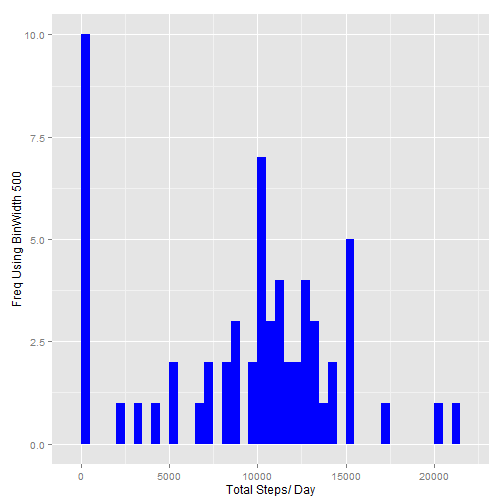
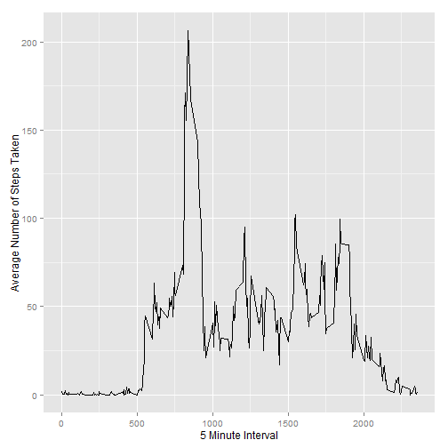
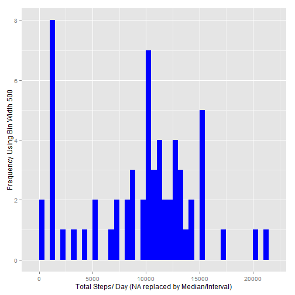
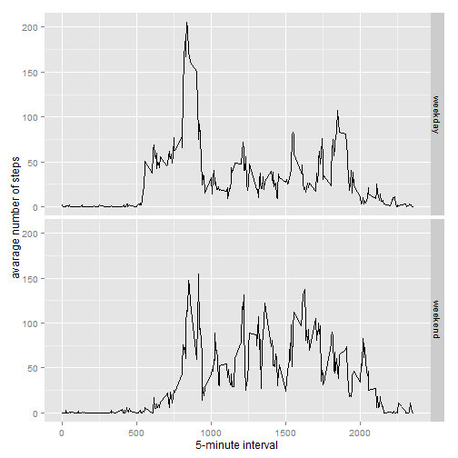

# Reproducible Research: Peer Assessment 1

##### 1. Load the data (i.e. read.csv())

```r
activityData <- read.csv('activity.csv')
```
-----

## What is mean total number of steps taken per day?

##### 1. Calculate the total number of steps taken each day

```r
stepsPerDay <- tapply(activityData$steps, activityData$date, sum, na.rm=TRUE)
```

##### 2. Make a histogram of the total number of steps taken each day

```r
library(ggplot2)
```

```
## Need help? Try the ggplot2 mailing list: http://groups.google.com/group/ggplot2.
```

```r
qplot(stepsPerDay, xlab='Total Steps/ Day', ylab='Freq Using BinWidth 500', binwidth=500, geom="histogram", fill=I("blue"))
```

 

##### 3. Calculate and report the mean and median total number of steps taken per day

```r
stepsPerDayMean <- mean(stepsPerDay)
stepsPerDayMedian <- median(stepsPerDay)
```
*Mean: 9354.2295082*
*Median:  10395*

-----

## What is the average daily activity pattern?

```r
averageStepsPerTimeBlock <- aggregate(x=list(meanSteps=activityData$steps), by=list(interval=activityData$interval), FUN=mean, na.rm=TRUE)
```

##### 1. Make a time series plot

```r
ggplot(data=averageStepsPerTimeBlock, aes(x=interval, y=meanSteps)) +
    geom_line() +
    xlab("5 Minute Interval") +
    ylab("Average Number of Steps Taken") 
```

 

##### 2. Which 5-minute interval, on average across all the days in the dataset, contains the maximum number of steps?

```r
mostSteps <- which.max(averageStepsPerTimeBlock$meanSteps)
ans<-averageStepsPerTimeBlock[mostSteps,'interval']
timeMostSteps<-gsub("[.]", "\\1:", ans/100)
```

*Most Steps at: 8:35*

----

## Imputing missing values
##### 1. Calculate and report the total number of missing values in the dataset 

```r
noMissingVal <- length(which(is.na(activityData$steps)))
```

*Number of missing values: 2304*

##### 2. Devise a strategy for filling in all of the missing values in the dataset.

* The strategy used here is to apply the median of the interval for all days

##### 3. Create a new dataset that is equal to the original dataset but with the missing data filled in.

```r
library(data.table)
DT <- data.table(activityData)
setkey(DT, interval)
DT[,steps := ifelse(is.na(steps), median(steps, na.rm=TRUE), steps), by=interval]
```

##### 4. Make a histogram of the total number of steps taken each day 

```r
stepsPerDayDT <- tapply(DT$steps, DT$date, sum)
qplot(stepsPerDayDT, xlab='Total Steps/ Day (NA replaced by Median/Interval)', ylab='Frequency Using Bin Width 500', binwidth=500, fill=I("blue"))
```

 

##### ... and Calculate and report the mean and median total number of steps taken per day. 

```r
stepsPerDayMeanDT <- mean(stepsPerDayDT)
stepsPerDayMedianDT <- median(stepsPerDayDT)
```
*Mean (NA replaced by Median/Interval): 9503.8688525*
*Median (NA replaced by Median/Interval):  10395*

**Since the Mean is less than the Median and also because the method of replacing the NA values is by using the Median for each 5-minute interval, the new Steps Mean is expected to drop while the Median remains the same.**
----

## Are there differences in activity patterns between weekdays and weekends?

##### 1. Create a new factor variable in the dataset with two levels - "weekday" and "weekend" indicating whether a given date is a weekday or weekend day.


```r
DT$dateType <-  ifelse(as.POSIXlt(DT$date)$wday %in% c(0,6), 'weekend', 'weekday')
```

##### 2. Make a panel plot containing a time series plot


```r
averageActivityDataDT <- aggregate(steps ~ interval + dateType, data=DT, mean)
ggplot(averageActivityDataDT, aes(interval, steps)) + 
    geom_line() + 
    facet_grid(dateType ~ .) +
    xlab("5-minute interval") + 
    ylab("avarage number of steps")
```

 
